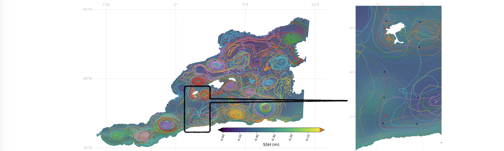

# Advecting  lagrangian particles with eNATL60 hourly currents (u,v at 15-m)
Stephanie Leroux, Ocean Next

* The computation of the lagrangian trajectories  is made with Ocean Parcels (https://oceanparcels.org/), based on hourly eNATL60 currents at 15 m in the two subregions of the EUROSEA project.
* Two different types of experiments were  performed, following two distinct request for Task2.3: 
  -  a.[For CLS: 4 sets of 146 particles advected for 4 months each, re-initiated every 3 months  to cover one year (2009-09 to 2010-06).](./lagrangian_traj_4cls.md)
  - b. [For IMEDEA: 1 set of 49 particles advected for 7 days (2009-09-01 to 2009-09-07) in a small subregion region.](./lagrangian_traj_4imeda.md)
* For each experiment, demo jupyter notebooks are also available. 

 
_Fig.1 Initial location and trajectories of  105  lagrangian particles over 4 months (2009-07 to 2009-10) computed with Ocean Parcels from the eNATL60 simulation  hourly currents in the MEDWEST predefined region. The averaged SSH field is shown as background. (a) shows the entire MEDWEST domain, (b) shows a zoom on a smaller region._

