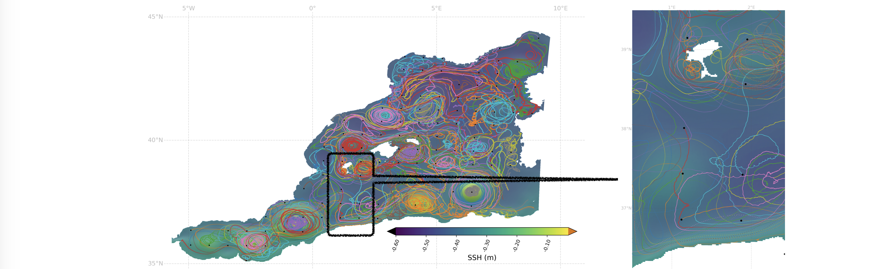
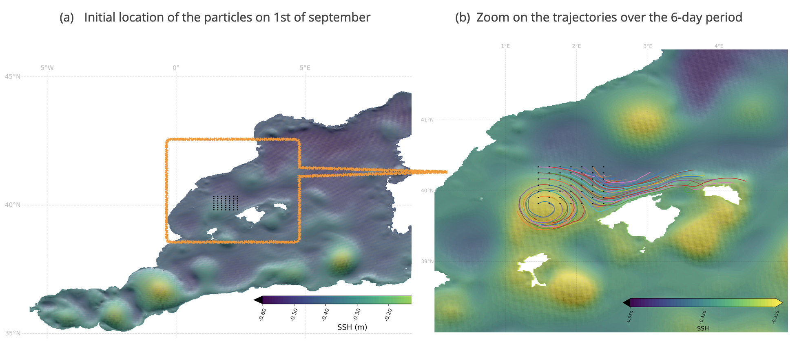

# Advecting  lagrangian particles with eNATL60 hourly currents (u,v at 15-m)
Stephanie Leroux, Ocean Next

* The computation of the lagrangian trajectories  is made with Ocean Parcels (https://oceanparcels.org/).
* Two different types of experiments were  performed, following two distinct request for Task2.3: 
  - For CLS: 4 sets of 146 particles advected for 4 months each, re-initiated every 3 months  to cover one year (2009-09 to 2010-06).
  - For IMEDEA: 1 set of 49 particles advected for 7 days (2009-09-01 to 2009-09-07) in a small subregion region.

---
### For CLS:  4 sets of 146 particles advected for 4 months each, re-initiated every 3 months  to cover one year (2009-09 to 2010-06)

_Where to download the data:_
  - https://ige-meom-opendap.univ-grenoble-alpes.fr/thredds/catalog/meomopendap/extract/Eurosea/Lagragian_trajectories_b/catalog.html

_What trajectories were computed:_ 
*  146 particles, evenly spaced, are initiated  in the MEDWEST region (see Fig.2 below for illustration) every 3 months, so that 4 sets of particles are  produced (labeled exp1, exp2, exp3, exp4), initiated on 1st of july 2009, 1st of october 2009, 1st of january 2010,1st of april 2010. 
* The initial locations of the particles are generated from the NEMO-eNATL60 grid, taking 1 location every 45 from the native NEMO grid. (--> it corresponds to one particle initiated every 45/60 = 0.75º)
* The lagrangian trajectories are then computed  for 4 months based on the horizontal currents (u,v) at 15 m depth, and computed and saved every 1h.
* Particles are deleted from the set when they reach the regional boundaries, so after 4 months, there is 105 particles left in exp 1, 103 in exp2, 108 in exp3, and exp4 respectively). See Fig.3 for an illustration.  The trajectories that are dropped before the end of  the 4 months are stored in additional files apart (see below).

_What do the netcdf files  contain:_
* For each experiment:  
  - One file contains all the trajectories that remain within the domain for the 4 months. 
  - Four additional files contains the trajectories that were dropped after 1, 2, 3 and 4 months. Those files are labeled  with “dropped1M” “dropped2M” “dropped3M” and “dropped4M”  respectively.
  - The files contain variables: time, lat, lon of each trajectory, and also interpolated values of u_convert, v_convert  at each particle location (other NEMO variables could be interpolated too,  upon request). 
  - The interpolation in space is done by Ocean Parcels, which carefully takes into account the specificities of the NEMO grid (C-grid) (see OP’s doc: https://nbviewer.jupyter.org/github/OceanParcels/parcels/blob/master/parcels/examples/tutorial_nemo_curvilinear.ipynb).
  - Each variable has  2 dimensions: ‘traj’  (id of each trajectory) and ‘obs’ (each obs along the trajectory, ie here every 1h for 4 month) . 
  - The interpolated u and v at 15m are given with the unit: m/s in the variables u_conv and v_conv in the file,   and in unit: deg/s in the variables u_interp, v_interp. 

* __Demo jupyter notebooks__:
  - How to create a particle set and advect it with Ocean Parcels [notebook here](./notebooks/2021-05-31_SLX_JZ_parcels_demo_advect.ipynb),
  - How to convert the sampled currents from degree/second in meters/second [notebook here](./notebooks/2021-05-31_SLX_JZ_parcels_demo-convert.ipynb),
  - How to plot the trajectories [notebook here](./notebooks/2021-05-31_SLX_JZ_parcels_demo-plots.ipynb)

 
_Fig.1 Initial location and trajectories of  105  lagrangian particles over 4 months (2009-07 to 2009-10) computed with Ocean Parcels from the eNATL60 simulation  hourly currents in the MEDWEST predefined region. The averaged SSH field is shown as background. (a) shows the entire MEDWEST domain, (b) shows a zoom on a smaller region._

---
### For IMEDEA: 49 particles advected for 7 days (2009-09-01 to 2009-09-07) in a small subregion region

* _Where to download the data:_  https://ige-meom-opendap.univ-grenoble-alpes.fr/thredds/catalog/meomopendap/extract/Eurosea/Lagragian_trajectories/catalog.html

* _What trajectories were computed:_
  - 49 particles, evenly spaced, are initiated  in each of the small subregion in MEDWEST and NANFL regions (see Fig.1 below for illustration). 
  - The lagrangian trajectories are computed  for 6 days based on the horizontal currents (u,v) at 15 m depth, starting on the 1st of september 2009, and computed and saved every 15 min.

* _What do the netcdf files  contain:_
  - The files contain variables: time, lat, lon of each trajectory, and also interpolated values of ssh, u_convert, v_convert  at each particle location. 
  - The interpolation in space is done by Ocean Parcels, which carefully takes into account the specificities of the NEMO grid (C-grid) (see: https://nbviewer.jupyter.org/github/OceanParcels/parcels/blob/master/parcels/examples/tutorial_nemo_curvilinear.ipynb).
  - Each variable has  2 dimensions: ‘traj’ (of size 49, for each particle) and ‘obs’ (of size 577, for each 15-min timestep of the 6-day period). 
  - the interpolated u and v at 15m are given in unit: m/s in the variables u_conv and v_conv in the file,   and in unit: deg/s in the variables u_interp, v_interp. 
Note2: 

* _Jupyter notebook available [here](./notebooks/2021-05-01_SLX_JZ_lagrangiantraj_4IMEDA.ipynb)._

 
_Fig.2 Initial location (a) and trajectories (b) of the 49  lagrangian particles  over the 6-day period from 1st of september to 7th of september 200,9 computed with Ocean Parcels from the eNATL60 simulation (no tide) hourly outputs in the MEDWEST predefined region. The SSH field is shown as background : (a) on the 1st of september, and  (b) averaged over the 6-day period._

