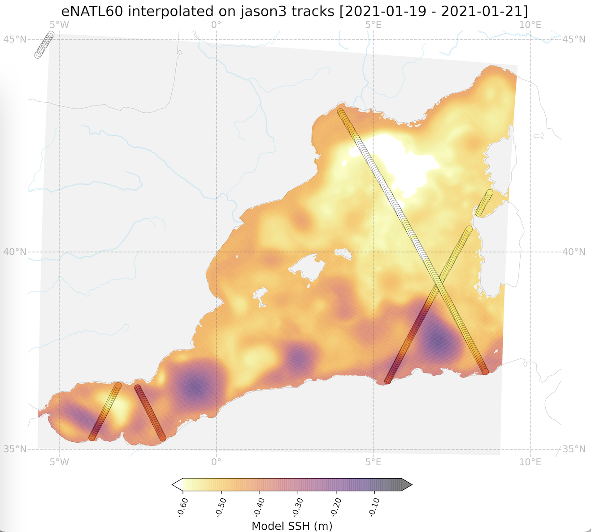

## Extracting alongtrack nadir SSH from eNATL60-no-tide in the EUROSEA target regions
Stephanie Leroux, UPDATED Feb 2022.

* _What?_ 
  - Along-track sampling of the model SLA (eNATL60-no-tide) in the MEDWEST subregion. 
  - The model SLA is computed by removing the time mean over the 1-year period (2020-07-01 to 2021-06-31) and then removing the spatial mean over the basin at each hourly model output.
  - The along track interpolation is made with the software gonzag (https://github.com/brodeau/gonzag) from Laurent Brodeau,  based on  the Akima interpolation method.
  - Each file is 6-month long:
  - In each file you’ll find:
    - sla_unfiltered (the real obs value (SLA)
    - slam (Sea Level Anomaly from model after removing time mean and spatial mean, interpolated at all alongtrack locations)
    - slam_np (Sea Level Anomaly from model after removing time mean and spatial mean, at nearest model grid point )
  - Important: Note that the sla_filtered value (the real obs) is _not_ expected to be consistent with the interpolated model values (slam) since the model was run in 2009-2010 and the real obs are taken in the years where the satellites exist (ex: jason3 over 2020-2021).

* _Data:_
Sampling of the model SSH along the satellite tracks of :
  - JASON3
    - From 2020-07-01 to 2020-12-31.
    - From 2021-01-01 to 2021-06-30.
  - Altika, Cryosat-2 (c2n), H2B, Sentinel-3A, Sentinel-3B: TO COME SOON.

* _Where to download the data:_
  - https://ige-meom-opendap.univ-grenoble-alpes.fr/thredds/catalog/meomopendap/extract/lerouste/Eurosea2022/pseudo-ssh-alongtrack/catalog.html

* _How is this done? (step by step documentation)_
  - Step1. [Notebook](https://github.com/ocean-next/EUROSEA/blob/main/notebooks/2022-02-18_download-sat-data.md) explaining how to download and prepare the satellite files before applying the interpolation tool.
  - Step2. [Notebook](https://github.com/ocean-next/EUROSEA/blob/main/notebooks/2022-02-18_prepare_model_files.md) explaining how to prepare the model files before applying the interpolation tool.
  - Step3. [Notebook](https://github.com/ocean-next/EUROSEA/blob/main/notebooks/2022-03-09_interpolation_alongtrack.ipynb) demonstrating the interpolation step.
  - Step4. [Notebook](https://github.com/ocean-next/EUROSEA/tree/main/notebooks/2022-02-18_plot_and_check_alontrack.ipynb) demonstrating how to read and plot the interpolated data and compare to the gridded model fields.

 
_Fig.1 Example of interpolated SSH along jason3 tracks (3 day period)_
