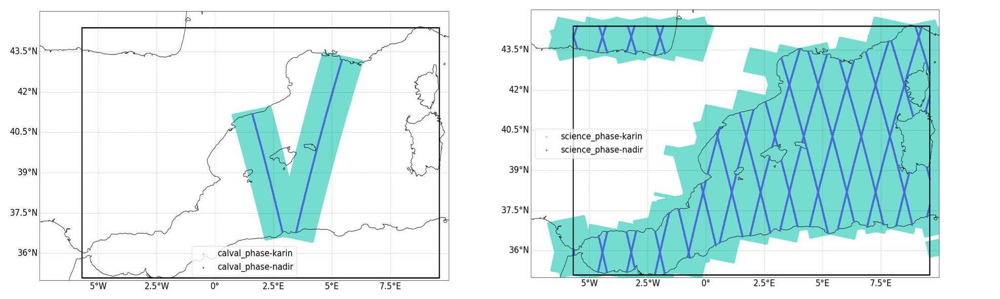
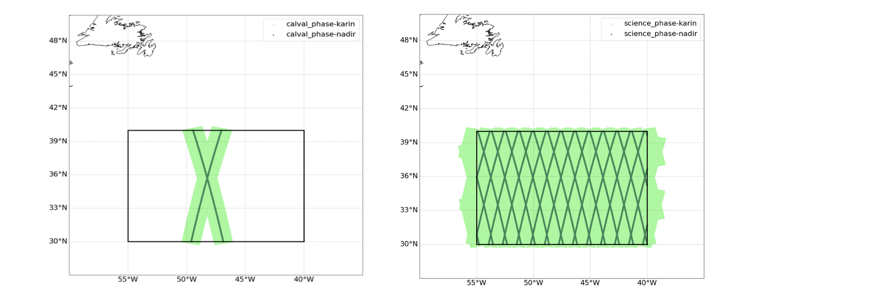

# Extracting  pseudo-SWOT observations  from eNATL60-no-tide in the EUROSEA target regions 

Aurélie Albert

In collaboration with M. Ballarota (CLS), the 2020 version of the SWOT Simulator (https://github.com/CNES/swot_simulator) was applied on eNATL60-BLB002 outputs (run without tides). 

* Two different configurations of SWOT have been applied for the period of eNATL60 01/07/2009-30/06/2010 : the __calval phase (fast-sampling)__ and the __science phase__ (see Fig.1 and 2).

* For each region, the files for the  calval phase and the science phase are in distinct directories. Then for each phase, __karin__ and __nadir data__ are in distinct directories (see Fig.3 and 4):
  - NANFL: https://ige-meom-opendap.univ-grenoble-alpes.fr/thredds/catalog/meomopendap/extract/Eurosea/SWOT-sim/catalog.html?dataset=meomscanpublic/Eurosea/SWOT-sim/NANFL.tar
  - MEDWEST: https://ige-meom-opendap.univ-grenoble-alpes.fr/thredds/catalog/meomopendap/extract/Eurosea/SWOT-sim/catalog.html?dataset=meomscanpublic/Eurosea/SWOT-sim/MEDWEST.tar   

* For karin data there are two dimensions : num_pixels (cross track) and num_lines (along track). The variables are ssh_karin, err_timing, err_roll, err_baseline_dilatation, err_phase, err_karin, err_wet_troposphere and ssh_karin_true (no errors).
See https://swot-simulator.readthedocs.io/en/latest/errors.html for  a description of the errors. _Note: this dataset was produced with the 2020 version  of the swot simulator and the simulation of the  karin noise has been improved since then._

* For nadir data, there is only num_lines dimension (no cross track). The variables are ssh_nadir, err_altimeter, err_wet_troposphere and ssh_nadir_true (no errors).

 
_Fig.1 The calval phase (fast-sampling) : repeating trajectories_

 
_Fig.2 The science phase : full coverage_

 
_Fig.3 MEDWEST tracks (calval phase and science phase)._

 
_Fig.4 NANFL tracks (calval phase and science phase)._
